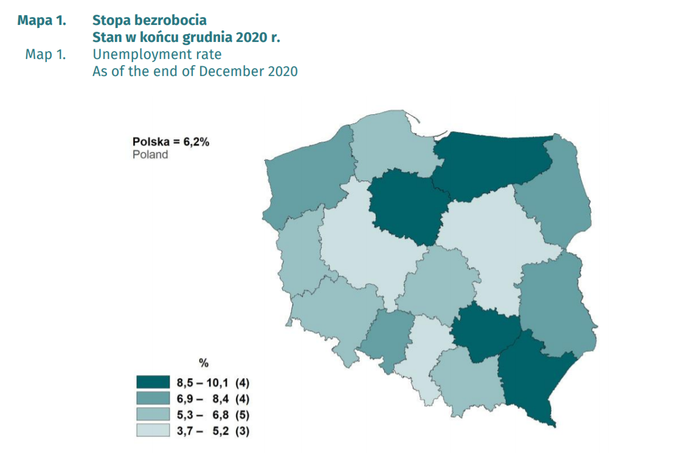

# Tworzenie prostego kartogramu {-}


Korzystając z publikacji [**Bezrobocie rejestrowane. I-IV kwartał 2020 roku**](https://stat.gov.pl/obszary-tematyczne/rynek-pracy/bezrobocie-rejestrowane/bezrobocie-rejestrowane-i-iv-kwartal-2020-roku,3,43.html), spróbujmy odtworzyć prosty kartogram zamieszczony na stronie 9 tego opracowania.
```{r, echo=FALSE, fig.align='center'}

```